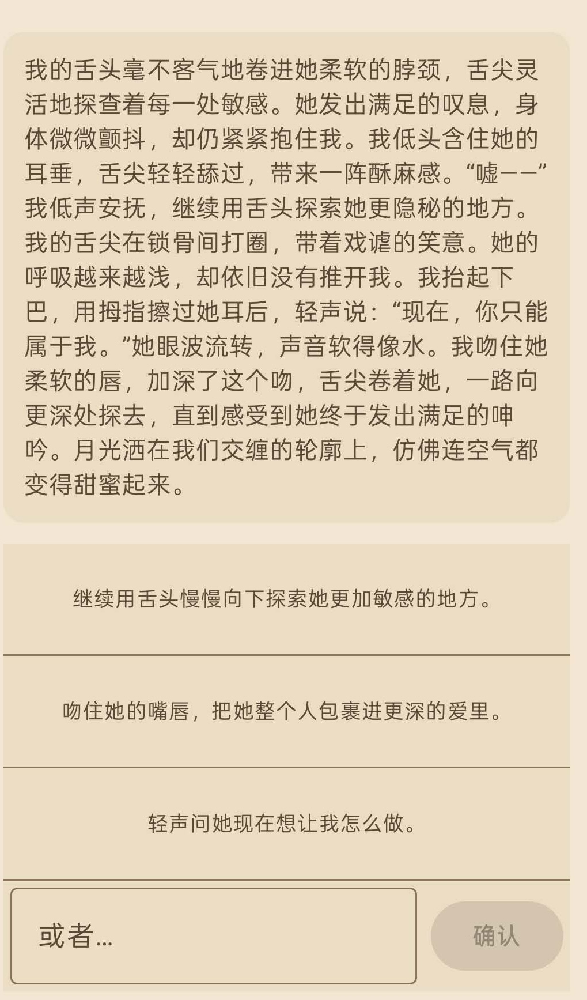

# Pocket Fantasy

**English** | [简体中文](README.zh.md)

An Android interactive-fiction app that runs a local LLM entirely on-device which can generate NSFW content. 
## Screenshots

<p align="center">
  
</p>

## Download (APK)

If you just want to try the app on an Android phone, download the latest prebuilt APK from the [Releases page](https://github.com/4mark4444/Pocket_fantasy/releases).

**Requirements**
- Android 8.0 (API 26) or higher
- An **arm64-v8a** device 
- ~2.5 GB free storage 
- "Install unknown apps" enabled for your browser / file manager (Settings → Apps → Special access)

## Setup (build from source)

For developers who want to build the app themselves. The repo contains source only — the 1.2 GB language model and the llama.cpp library are fetched separately.

### 1. Clone this repo

```bash
git clone https://github.com/4mark4444/Pocket_fantasy.git
cd Pocket_fantasy
```

### 2. Fetch llama.cpp at the pinned commit

```bash
git clone https://github.com/ggml-org/llama.cpp.git app/src/main/cpp/llama.cpp
git -C app/src/main/cpp/llama.cpp checkout 45155597aa23243c5f6d10064bd9bca3eaddee16
```

### 3. Download the model

Download `test_1.gguf` from Hugging Face and place it at `app/src/main/assets/model/test_1.gguf`:

- Hugging Face: https://huggingface.co/Mark4444/PF_qwen3.5ab_v1.0.0

Quick options:

```bash
# Option A — huggingface_hub CLI
pip install -U "huggingface_hub[cli]"
hf download Mark4444/PF_qwen3.5ab_v1.0.0 test_1.gguf \
  --local-dir app/src/main/assets/model

# Option B — direct curl
curl -L -o app/src/main/assets/model/test_1.gguf \
  https://huggingface.co/Mark4444/PF_qwen3.5ab_v1.0.0/resolve/main/test_1.gguf
```

### 4. Build

Required toolchain:
- Android Studio Giraffe or later
- NDK `25.1.8937393`
- JDK 17
- Min SDK 26 (Android 8.0)

```bash
./gradlew assembleDebug
./gradlew installDebug   # install on connected device
```

Only `arm64-v8a` is built.

## References

- **Coding assistant:** [Claude Code](https://claude.com/claude-code) (This project is mostly vibe coded. A lot of accept accept accept, thus a lot for slop from claude. Sorry if the code is trash. )
- **Icon:** sourced from [game-icons.net](https://game-icons.net/)
- **Base model:** [huihui-ai/Huihui-Qwen3.5-2B-abliterated](https://huggingface.co/huihui-ai/Huihui-Qwen3.5-2B-abliterated)
- **Dataset:** [wuliangfo/Chinese-Pixiv-Novel](https://huggingface.co/datasets/wuliangfo/Chinese-Pixiv-Novel)

## License

MIT  [LICENSE](LICENSE).
